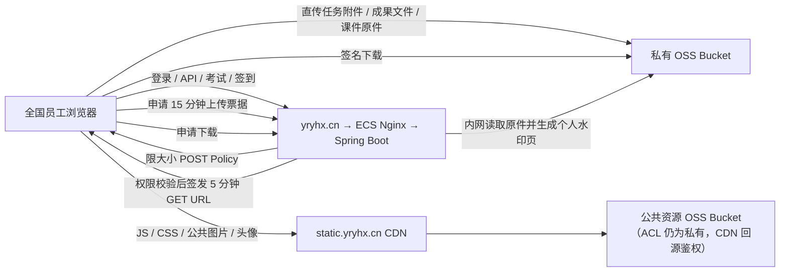

# 阿里云 OSS、CDN 与域名生产架构

本文是 `yryhx.cn` 的生产部署基线，覆盖 ECS、私有 OSS 签名传输、公共 OSS＋CDN、文件迁移、DNS、HTTPS、验收和回退。脚本位于 `deploy/aliyun/`。

## 1. 当前状态与上线门槛

截至 2026-09-02 的实机检查结果：

| 项目 | 当前证据 |
| --- | --- |
| ECS | 华东 2（上海），4 核 8 GiB，公网 IP `139.224.51.21`，应用运行中 |
| 云盘 | 40 GiB 系统盘挂载 `/`；100 GiB ESSD 数据盘已格式化为 ext4 并按 UUID 持久挂载 `/data`，MySQL、上传回退目录、课件预览缓存、备份和发布候选均使用数据盘 |
| 网络 | 安全组已开放 80、443；ECS Nginx 已安装主站证书并启用 HTTPS；正式 DNS 已生效，根域名与 `www` 的外网 TLS、健康接口和 301 跳转均已验证通过 |
| 文件 | 线上应用已切换为 `STORAGE_TYPE=oss`；长期 AccessKey 留空，ECS 通过 IMDSv2 获取临时凭证 |
| OSS | 上海 ZRS Bucket `yryhx-talent-private-cn-shanghai` 与 `yryhx-talent-public-cn-shanghai` 已创建且保持私有 ACL；CORS 已允许私有 Bucket 使用 `POST`，`TalentPlatformOssRole` 绑定和最小权限策略已生效；公共图片、私有课件和私有附件真实上传/读取/预览/删除验收通过 |
| 域名 | `yryhx.cn` 使用阿里云 DNS；`@` A 指向 `139.224.51.21`，`www` CNAME 指向根域名，`static` CNAME 指向 `static.yryhx.cn.w.kunlunaq.com`，三条正式业务记录已生效 |
| 证书 | 三张 DigiCert RSA 2048 DV 证书均已签发；主站证书已安装到 ECS，`cert-70iod6` 已部署到 CDN 并覆盖 `static.yryhx.cn`；当前证书均有效至 2026-11-10 |
| 备案 | 管局审核已通过；主体备案号为 `湘ICP备2026035229号`，`yryhx.cn` 的网站备案号为 `湘ICP备2026035229号-1` |
| 网站合规页脚 | 已随 `main@d0fde6c2` 部署；登录页及登录后所有业务页面统一展示 `湘ICP备2026035229号-1`，并链接工信部备案系统 `https://beian.miit.gov.cn/`；公安备案号待审核完成后再加入，不展示占位号 |
| CDN/ESA | `static.yryhx.cn` 已启用中国内地“图片小文件”CDN；源站为私有 ACL 的公共静态资源 OSS Bucket，同账号私有回源、HTTPS、HTTP→HTTPS、TLS 1.2/1.3、Gzip 和长期缓存均已验证；OSS 写入 `immutable`，CDN 可能规范化为不少于 30 天的 `max-age`；不启用 ESA 等非必要增值服务 |

当前线上运行的应用功能基线为任务评分详情布局 PR #42 合并提交 `ce09edcd1770439a3492f50fdfbcbc48380b586c`。生产 JAR SHA-256 为 `29e7259eb03462515ad1933e309cb9cb77594ebf23b2a58ddc20555e201755e1`，Flyway 保持 V37。候选 `/data/talent-platform/releases/staging/cdn-ce09edcd-20260902-1640` 已通过 `activate-cdn-release.sh` 激活；激活前 JAR 和环境回滚材料位于 `/data/talent-platform/releases/history/cdn-activation-20260902164657-3439939/`，部署前数据库备份位于 `/data/talent-platform/backups/mysql/talent-platform-20260902-164057.sql.gz`，其 SHA-256 为 `4b63416ba31249edc3c18e7169f2a095f51eb5a407fda28015bad109d2741c58`。

### 2026-09-02 任务评分详情宽度与员工归属列调整部署记录

- GitHub：任务评分详情布局 PR [#42](https://github.com/Heart1ess1/talent-development-platform/pull/42) 已合并，功能提交为 `96d04dee`，合并后的生产基线为 `main@ce09edcd1770439a3492f50fdfbcbc48380b586c`。
- 功能范围：任务评分详情抽屉由 `min(1120px, 96vw)` 加宽为 `min(1400px, 98vw)`，改善右侧操作列和员工表格显示；员工表格将原“班级 / 职务”“评分范围”拆分为“批次、板块、班级、评分人”四列，便于直接核对每名员工的归属和评分责任。
- 构建校验：前端 43 项测试、TypeScript 检查和 CDN 生产构建通过；后端 138 项测试及生产 JAR 打包通过。生产 JAR SHA-256 为 `29e7259eb03462515ad1933e309cb9cb77594ebf23b2a58ddc20555e201755e1`。
- 备份与回退：部署前数据库备份为 `/data/talent-platform/backups/mysql/talent-platform-20260902-164057.sql.gz`，SHA-256 为 `4b63416ba31249edc3c18e7169f2a095f51eb5a407fda28015bad109d2741c58`；激活前回滚材料位于 `/data/talent-platform/releases/history/cdn-activation-20260902164657-3439939/`。
- 发布材料：79 个静态资源已同步至公共资源 OSS；候选目录为 `/data/talent-platform/releases/staging/cdn-ce09edcd-20260902-1640`，CDN 主资源为 `https://static.yryhx.cn/assets/index-C1U3_6zU.js`。激活期间出现三次短暂 502，脚本重试后恢复 `UP`。
- 数据复核：Flyway 保持 V37，任务 12 仍由两条范围完整覆盖 66 人且无空范围；陈立青负责 `2025 / 机动车板块 / 机动车班` 36 人，原 30 条已完成评分完整保留；朱小红负责 `2025 / 城轨板块 / 城轨班` 30 人，并在本次发布前后实际完成 4 条评分，当前剩余 26 条待评分。范围匹配、评分记录范围和评分人成员一致性错误均为 0。
- 生产校验：应用、MySQL 和 Nginx 容器正常，健康状态 `UP`；新 CDN 主资源返回 200、`text/javascript` 和 `max-age=31104000`，OSS 原始地址匿名访问返回 403，未登录评分范围接口返回 401，生产就绪检查为 `ready: true`，部署后日志未发现 `ERROR` 或 `Exception`。
- 待人工复核：本次已完成代码、构建、接口、数据和生产运行验收；登录后的弹窗宽度及四列视觉效果仍需使用真实管理员或评分人账号目视确认。

### 2026-09-02 任务评分范围与平均分排序部署记录

- GitHub：任务评分范围 PR [#40](https://github.com/Heart1ess1/talent-development-platform/pull/40) 已合并，功能提交为 `ec9c11ac3aedaece406df71dc551a247c89e614d`，合并后的生产基线为 `main@6870f8c2551dd85b8d961f5eb2da3b17914e88b1`。
- 功能范围：任务可按批次、板块、班级交集配置多条评分范围；保存时校验全量覆盖、范围互斥和评分人有效性；评分权限、成果读取与待评分队列按员工范围隔离；任务下发和任务评分页面支持统一或按范围配置；最终平均分列支持降序、升序和默认三态排序。
- 构建校验：前端 43 项测试、TypeScript 检查和 CDN 生产构建通过；后端 138 项测试及生产 JAR 打包通过。生产 JAR SHA-256 为 `b1b3ef556aadd2aba7845b4951b2ef888e7acad932c89a435805cf8c3d921863`。
- 备份与回退：部署前数据库备份为 `/data/talent-platform/backups/mysql/talent-platform-20260902-155238.sql.gz`，SHA-256 为 `07e7af16d600db0a5c2634621afee756f484377f58d506c169c8d4dec69e8ef1`；V37 执行后、任务 12 范围调整前再次备份为 `/data/talent-platform/backups/mysql/talent-platform-20260902-155919.sql.gz`，SHA-256 为 `5bdc2c928f749b39db4b911d0c70f7c9bb6dd2797d37a3ffe4a08239c6fb5be3`；激活前回滚材料位于 `/data/talent-platform/releases/history/cdn-activation-20260902155659-3433074/`。
- 发布材料：79 个静态资源已同步至公共资源 OSS；候选目录为 `/data/talent-platform/releases/staging/cdn-6870f8c2-20260902-1553`，CDN 主资源为 `https://static.yryhx.cn/assets/index-DFksoCEj.js`。激活期间出现三次短暂 502，脚本重试后恢复 `UP`。
- 数据迁移：Flyway V37 `task reviewer scopes` 成功。任务 12“8月份售后学习月报收集”已配置两条范围：陈立青负责 `2025 / 机动车板块 / 机动车班` 36 人并完整继承原 30 条已完成评分；朱小红负责 `2025 / 城轨板块 / 城轨班` 30 人并生成 30 条待评分记录。范围覆盖错误、评分范围错配和评分人错配均为 0，操作日志为 `ADMIN_MIGRATE_TASK_REVIEWER_SCOPES`（记录 ID 1042）。
- 生产校验：应用、MySQL 和 Nginx 容器正常，Flyway V37、健康状态 `UP`、生产 JAR 哈希和公网主资源均已核对；新 CDN 主资源返回 200、`text/javascript` 和 `max-age=31104000`，OSS 原始地址匿名访问返回 403，未登录评分范围接口返回 401，生产就绪检查为 `ready: true`，部署后日志未发现 `ERROR` 或 `Exception`。
- 待人工复核：生产环境变量中的初始超级管理员密码已不是当前密码，内置浏览器又在加载页面时超时，因此已登录后的范围展示和平均分表头三态交互尚未形成视觉验收证据；不影响数据库、接口权限、构建和运行状态验收。

### 2026-08-29 任务评分员工筛选项调整部署记录

- GitHub：任务评分员工筛选 PR [#38](https://github.com/Heart1ess1/talent-development-platform/pull/38) 已合并，功能提交为 `cd1d057272387ea524c922dca73005c4faf28110`，合并后的生产基线为 `main@259cf76d36af5ccac7278f7e9584329bff1a8309`。
- 功能范围：详情中的三个员工筛选从左到右调整为批次、板块、班级；关键字搜索同步支持姓名、工号、批次、板块和班级；评分详情接口补充员工批次与板块字段。
- 构建校验：前端 40 项测试、TypeScript 检查和 CDN 生产构建通过；后端 134 项测试及生产 JAR 打包通过。生产 JAR SHA-256 为 `5f130c847d16cdb5f91d3f457db53c84b1304b8491285552029a9e5f0a04d861`。
- 备份与回退：部署前数据库备份为 `/data/talent-platform/backups/mysql/talent-platform-20260829-161045.sql.gz`，SHA-256 为 `bcf8bca15db29b5de63021c180f8ba4ccf1ac4573e06887121ba132f9c58d39c`；激活前回滚材料位于 `/data/talent-platform/releases/history/cdn-activation-20260829161234-2786631/`，其中旧 JAR SHA-256 为 `8333c304e98545c1a5d01d8269d76984c3d2f28e8e982974d00c796f782849d3`。
- 发布材料：77 个静态资源已同步至公共资源 OSS；候选目录为 `/data/talent-platform/releases/staging/cdn-task-scoring-filters-259cf76d-20260829-1610`，CDN 主资源为 `https://static.yryhx.cn/assets/index-CvRBxVuP.js`。激活期间出现三次短暂 502，脚本重试后恢复 `UP`。
- 生产校验：应用、MySQL 和 Nginx 容器正常；Flyway 保持 V36；`/task-scoring` 返回 200，未登录访问任务评分 API 返回 401；部署后日志未发现 `ERROR` 或 `Exception`；公网首页已引用新 CDN 主资源，任务评分分块返回 200 和 `max-age=31104000`，OSS 原始地址匿名访问返回 403，生产就绪检查为 `ready: true`。

### 2026-08-29 任务评分详情显示与员工筛选部署记录

- GitHub：任务评分详情优化 PR [#36](https://github.com/Heart1ess1/talent-development-platform/pull/36) 已合并，功能提交为 `5c773e989334f3ff1fcbff7be54bc50008aa7c75`，合并后的生产基线为 `main@a3d1acbea688cfadef8f1f650b9ededcb7db0fe7`。
- 功能范围：取消员工表格 560 px 固定高度，改由详情抽屉自然滚动；增加姓名、工号、班级、班级职务关键字搜索，以及班级、班级职务、提交状态和评分状态组合筛选；后端评分详情补充员工班级与班级职务字段。
- 构建校验：前端 40 项测试、TypeScript 检查和 CDN 生产构建通过；后端 134 项测试及生产 JAR 打包通过。生产 JAR SHA-256 为 `8333c304e98545c1a5d01d8269d76984c3d2f28e8e982974d00c796f782849d3`。
- 备份与回退：部署前数据库备份为 `/data/talent-platform/backups/mysql/talent-platform-20260829-155223.sql.gz`，SHA-256 为 `e4d036b5a113e74df3f1ef8f9feaed610d74e7dad74a8aecc06f0abee67f0834`；激活前回滚材料位于 `/data/talent-platform/releases/history/cdn-activation-20260829155409-2783710/`，其中旧 JAR SHA-256 为 `89aab0f016b800364acf20f25c2865cac8aade984ab5d354c8476f08e4f68424`。
- 发布材料：77 个静态资源已同步至公共资源 OSS；候选目录为 `/data/talent-platform/releases/staging/cdn-task-scoring-layout-a3d1acbe-20260829-1552`，CDN 主资源为 `https://static.yryhx.cn/assets/index-CnBXGK7H.js`。激活期间出现两次短暂 502，脚本重试后恢复 `UP`。
- 生产校验：应用、MySQL 和 Nginx 容器正常；Flyway 保持 V36；`/task-scoring` 返回 200，未登录访问任务评分 API 返回 401；部署后日志未发现 `ERROR` 或 `Exception`；公网首页已引用新 CDN 主资源，任务评分分块返回 200 和 `max-age=31104000`，OSS 原始地址匿名访问返回 403，生产就绪检查为 `ready: true`。
- 待人工复核：内置浏览器可以打开正式站点登录页，但没有已登录会话；需使用管理员或评分人账号进入任务评分详情，目视确认员工表格展示范围、抽屉滚动和组合筛选交互。

### 2026-08-29 任务评分人与独立评分工作台部署记录

- GitHub：任务评分工作台 PR [#34](https://github.com/Heart1ess1/talent-development-platform/pull/34) 已合并，功能提交为 `a70e276c9944a58cd42f9cda10403cd26dee275b`，合并后的生产基线为 `main@2ffd548f5e67e9d99c3b0c8e248b067dfa69a3ca`。
- 功能范围：任务可配置多名启用的非员工评分人；新增独立任务评分工作台；管理员可查看全部任务但只能评分本人任务，导师和服务站负责人只查看本人评分任务；多人全部通过后取一位小数平均分，任一人退回立即结束本轮；任务跟踪取消直接审核并保留只读评分进度。
- 构建校验：前端 37 项测试、TypeScript 检查和 CDN 生产构建通过；后端 134 项测试及生产 JAR 打包通过。生产 JAR SHA-256 为 `89aab0f016b800364acf20f25c2865cac8aade984ab5d354c8476f08e4f68424`。
- 备份与回退：部署前数据库备份为 `/data/talent-platform/backups/mysql/talent-platform-20260829-144103.sql.gz`，SHA-256 为 `ba51135b79d20b017311fca0cb35d8ba9e8c3315310569fb77167965f5594530`；激活前 JAR 和环境材料位于 `/data/talent-platform/releases/history/cdn-activation-20260829144312-2774473/`，其中旧 JAR SHA-256 为 `e1cc805303b42691eae8ead74ab6be8234af71c059be99c268f01b6b6f2e1fb2`。
- 发布材料：候选目录为 `/data/talent-platform/releases/staging/cdn-task-scoring-2ffd548f-20260829-1441`，CDN 探针为 `https://static.yryhx.cn/assets/index-CEEhG1RY.js`。激活期间容器重建出现短暂 502，脚本重试后恢复 `UP` 并完成哈希一致性校验。
- 数据库校验：Flyway V36 `task scoring reviewers` 成功；`task_reviewer`、`task_submission_review` 两张表存在；`task_assignment.final_score` 和 `task_submission.score` 均为 `decimal(5,1)`。
- 生产校验：应用、MySQL 和 Nginx 容器正常；`/task-scoring` 返回 200，未登录访问任务评分 API 返回 401；部署后日志未发现 `ERROR` 或 `Exception`；CDN 主资源返回 200、`text/javascript` 和 `max-age=31104000`，OSS 原始地址匿名访问返回 403，生产就绪检查为 `ready: true`。
- 数据边界：历史任务未自动配置评分人，需管理员按实际职责为未完成任务补充评分人；本次未向生产数据库写入虚构任务、评分人或测试评分数据。

### 2026-08-28 上传票据回收与提交进度部署记录

- GitHub：成果提交与上传进度功能 PR [#31](https://github.com/Heart1ess1/talent-development-platform/pull/31) 已合并，功能提交为 `bc09ffc12be4338cbbacc7ce94354192e82d711a`；CDN 缓存就绪检查兼容性修复 PR [#32](https://github.com/Heart1ess1/talent-development-platform/pull/32) 已合并，当前 `main` 为 `191c600ea72a387170ab4257b618c0c7b09d6894`。
- 功能范围：成果提交弹窗增加逐文件进度和统一状态；提交期间锁定交互；OSS 直传使用进度事件；上传或最终登记失败时自动废弃本次未消费票据；新增本人未消费票据的幂等删除接口；票据上限提示改为中文。
- 构建校验：前端 35 项测试、TypeScript 检查、CDN 生产构建及生产依赖审计通过，未发现已知生产依赖漏洞；后端 127 项测试通过。生产 JAR SHA-256 为 `e1cc805303b42691eae8ead74ab6be8234af71c059be99c268f01b6b6f2e1fb2`。
- 备份与回退：部署前数据库备份为 `/data/talent-platform/backups/mysql/talent-platform-20260828-172010.sql.gz`，SHA-256 为 `e642e67b661e6894f627246f11c8e8f054d1f549dd208ce5e9ccad776245f13e`；激活前 JAR 和环境材料位于 `/data/talent-platform/releases/history/cdn-activation-20260828172402-2629519/`。
- 发布材料：75 个静态文件已同步至公共资源 OSS；候选目录为 `/data/talent-platform/releases/staging/cdn-bc09ffc1-20260828-172006`，CDN 探针为 `https://static.yryhx.cn/assets/index-JiKyknqF.js`。
- 生产校验：应用健康状态为 `UP`，MySQL、应用和 Nginx 容器均正常；Flyway 成功校验 35 个迁移且无需新增迁移；部署后日志无 `ERROR` 或 `Exception`；公网首页已引用新资源，未登录删除上传票据接口返回 401，CDN 探针返回 200、`text/javascript` 和 `max-age=31104000`，生产就绪检查返回 `ready: true`。
- OSS 业务冒烟：私有 OSS 签名上传、下载和删除清理全链路通过，临时任务、附件、票据和 OSS 对象均已清理。
- 待人工复核：内置浏览器建立生产页面会话时超时，因此员工成果提交弹窗的生产视觉效果尚未形成浏览器证据；需使用真实员工账号上传一个小文件，确认进度条、提交中锁定和成功状态显示正常。

### 2026-08-19 人员台账列宽调整部署记录

- GitHub：PR #24 已合并，部署 `main` 合并提交 `f6d3799c24c47751fe6aad7c5e4c7dd2c46afc04`。
- 界面调整：技术、技能指导老师列各由 160 px 收窄到 140 px；毕业学校由 140 px 调整到 160 px，所学专业由 130 px 调整到 150 px，学历由 76 px 调整到 100 px。
- 构建校验：前端 22 项测试、类型检查和 CDN 生产构建通过；后端 107 项测试通过。生产 JAR SHA-256 为 `b9c1061414546a5fda90db2b4bde67ce7d0a246516a197915afda2ff9742ab1d`。
- 数据库备份：`/data/talent-platform/backups/mysql/talent-platform-20260819-000832.sql.gz`，SHA-256 `2e631eae8db60a611fd1c0629fa70ca32ba742970ab9488ea0577cc3132bb4d5`。
- 发布材料：75 个静态资源已同步到公共资源 OSS；候选目录为 `/data/talent-platform/releases/staging/cdn-f6d3799c-20260819-0006`，激活前回滚材料位于 `/data/talent-platform/releases/history/cdn-activation-20260819000840-1053093/`。
- 生产校验：应用和 MySQL 容器正常，应用健康状态为 `UP`，Flyway 保持 V30，部署后日志无 `ERROR` 或 `Exception`。公网首页已引用 `index-DrZyoLLJ.js`，健康接口返回 200；CDN 主资源返回 200、`text/javascript` 和一年 immutable 缓存。

### 2026-08-18 字典值、员工班级与备注功能部署记录

- GitHub：PR #22 已合并，部署 `main` 合并提交 `0aa92812b8017a0edb802fda8bf1e3fd6bb2006b`。
- 构建校验：前端 22 项测试、类型检查和 CDN 生产构建通过；后端 107 项测试通过。生产 JAR SHA-256 为 `42fcec6a06ce08c7d1ad0b77562fb137eec7eeb6de14463ca107bb62b725566f`。
- 数据库备份：`/data/talent-platform/backups/mysql/talent-platform-20260818-235353.sql.gz`，SHA-256 `9d45d1932b1bb579626efbc288819009308bc990eaedd2cb4027f6782af73a06`。
- 发布材料：75 个静态资源已同步到公共资源 OSS；候选目录为 `/data/talent-platform/releases/staging/cdn-0aa92812-20260818-2352`，激活前回滚材料位于 `/data/talent-platform/releases/history/cdn-activation-20260818235414-1050477/`。
- 数据库迁移：Flyway V29 `dictionary value management` 与 V30 `employee class and notes` 均成功；`employee.class_id` 为 `BIGINT`，`employee.notes` 为 `TEXT`。生产库不预置业务班级，由管理员通过字典值管理或人员台账“新增班级”录入真实班级。
- 生产校验：应用健康状态为 `UP`，MySQL 为 `healthy`，数据盘已挂载且使用率 2%，部署后 10 分钟日志中无 `ERROR` 或 `Exception`。公网健康接口返回 200；CDN 探针 `https://static.yryhx.cn/assets/index-SeFFVyH1.js` 返回 200、`text/javascript` 和一年 immutable 缓存；未登录字典管理接口返回 401。

### 2026-08-17 正式域名与 CDN 上线记录

- DNS：阿里公共 DNS 与 1.1.1.1 均确认 `yryhx.cn`、`www.yryhx.cn` 和 `static.yryhx.cn` 生效；HTTP 主站及 CDN 静态域名均以 301 跳转 HTTPS。
- CDN：同账号私有 OSS 回源已授权，仅从 `yryhx-talent-public-cn-shanghai` 分发公共静态资源；私有课件与附件 Bucket 未接入 CDN。
- TLS：`static.yryhx.cn` 使用 DigiCert RSA 2048 证书 `cert-70iod6`，有效期至 2026-11-10；仅启用 TLS 1.2/1.3，HSTS 暂未启用以保留回退能力。
- 缓存：探针 `https://static.yryhx.cn/assets/index-nISaq9DD.js` 返回 200、`text/javascript`、`Cache-Control: public, max-age=31536000, immutable`，固定节点连续命中内存缓存。
- 应用：正式登录页真实浏览器渲染成功并展示 `湘ICP备2026035229号-1`；健康接口返回 `UP`，未登录受保护接口返回 401。`/favicon.ico` 暂返回 401，已作为非阻塞 UX 待办记录。
- 观察：2026-08-17 16:39 至 2026-08-18 16:35 的 24 小时观察已完成。`talent-platform-go-live-observer.timer` 每 5 分钟调用 `go-live-observer.sh` 检查正式域名、HTTPS、CDN 静态资源、健康接口、未登录权限边界、容器和数据盘；日志 `/data/talent-platform/monitoring/go-live-20260817.tsv` 共 279 行，其中 278 次 `PASS`、0 次 `FAIL`、0 条 `DETAIL`、1 次 `COMPLETE`，截止后定时器已自动停用。4 个采样窗口出现 `recent_errors=1`，追溯为 3 次被拒绝的异常外部请求（2 次不支持的 POST、1 次非法 Host），没有应用内部异常或可用性中断；临时公网 IP/未知 Host 默认入口加固已记录为 `SEC-002`。2026-08-18 19:21 再次复核应用为 `UP`、MySQL 为 `healthy`、CDN 为 `TCP_HIT`、数据盘使用率 2%。登录后的考试、课件和附件流程仍需使用真实账号在正式域名下复核，完成前暂不提高 DNS TTL。

### 2026-08-13 任务优先评分人范围配置部署记录

- GitHub：PR #12 已通过代码、安全边界和测试复核并合并，部署 `main` 合并提交 `3a611a44c8d1fc79c4a953148d1afbfade4e535f`。
- 构建校验：从精确的 `origin/main` 隔离工作树采用根路径静态资源构建；前端 12 项、后端 96 项测试及生产构建通过，前端生产依赖审计为 0 个已知漏洞；生产 JAR SHA-256 为 `7ef1009d48211b5ae386543bfa3399ffe3a3a39de8119f2ae2bbf9f229f15ce5`。
- 数据库备份：`/data/talent-platform/backups/mysql/talent-platform-20260813-032813.sql.gz`，SHA-256 `7aad2d95612b3b5dba04f40d622596f7a4ca0351ab0d71e0366f96acfb91cd64`。
- 生产校验：应用容器重建成功且健康状态为 `UP`；Flyway V27 成功；`evaluation_reviewer_scope_rule`、`evaluation_reviewer_scope_member`、`assignment_source` 和 `scope_rule_id` 均已落库；服务器 JAR 哈希与本机构建一致。
- 公网校验：`/actuator/health` 返回 200，`/evaluation/assignments` 返回根路径资源版 SPA 页面 200，未登录 `/api/v1/evaluation/assignments/overview?month=2026-08` 返回 401。
- 业务验收：在隔离 MySQL 8.4 环境完成创建全员规则、生成员工任务、自动写入 `SCOPE_RULE` 分配、覆盖统计和只读详情的浏览器主链路；生产环境未创建演示评分规则，避免污染真实评分配置。

### 2026-08-13 评分任务与评分人编排部署记录

- GitHub：PR #11 已合并，历史部署提交为 `e53e4b08d7fd34423a2a57232589b5c3e1fc1470`。
- 构建校验：前端 12 项测试、生产构建及后端 92 项测试通过；采用根路径静态资源构建，生产 JAR SHA-256 为 `d46b3452fffd51baa5bde2c6c1abdbe2a243434cea870a416f1a93f684b4fffb`。
- 数据库备份：`/data/talent-platform/backups/mysql/talent-platform-20260813-023457.sql.gz`，SHA-256 `2dc785055384564d85b95e85a05d97bf3598355d6347ebc01e18d6be407831fd`。
- 回滚材料：`/data/talent-platform/releases/history/pre-e53e4b0-20260813-023457/`，包含上一版 JAR、`.env` 和哈希文件。
- 生产校验：云助手任务成功且退出码为 0，应用健康状态为 `UP`，线上 JAR 哈希与本机构建一致，Flyway V26 成功；`evaluation_rating_task`、`evaluation_rating_reviewer` 两张表存在。
- 公网校验：`/actuator/health` 返回 200，`/evaluation/assignments` 返回 SPA 页面 200，未登录 `/api/v1/evaluation/assignments?month=2026-08` 返回 401。

### 2026-08-13 综合评价优化部署记录

- GitHub：PR #9 已审查、通过测试并合并，部署提交为 `90d09a4a9276a30d21afe1a4de61fda741963bcf`。
- 构建校验：前端 12 项测试、生产构建、后端 88 项测试及前端生产依赖审计通过；生产 JAR SHA-256 为 `7ead9945d8a0335741c2df2db4c04a7bdf7cff1b9e4eb1b69576eee02d21af4a`。
- 数据库备份：`/data/talent-platform/backups/mysql/talent-platform-20260813-010559.sql.gz`，SHA-256 `b4835239b4e81ed261a94a71a1efdc7ab663a3614a1d4981b96e7301a19c8099`。
- 回滚材料：`/data/talent-platform/releases/history/pre-90d09a4-20260813-010559/`，包含上一版 JAR、`.env` 和哈希文件。
- 生产校验：应用健康状态为 `UP`，Flyway V25 生效；OSS 切换、公开文件、私有课件和私有附件四组冒烟脚本通过。
- 综合评价接口：`/evaluation/monthly/candidates`、`/evaluation/source-options` 和 `/evaluation/templates` 均返回正确数据结构；当前生产库尚无员工、任务、考试和评价模板测试数据。

### 2026-08-12 部署记录

- 数据库备份：`/data/talent-platform/backups/mysql/talent-platform-20260812-230705.sql.gz`，SHA-256 `2eb3114fc2488896c1339871af761bff5ba47629d86d7f3338870d5eab994862`。
- 部署前回滚 JAR：`/data/talent-platform/releases/history/pre-491380f-20260812-230714/talent-platform.jar`，SHA-256 `272cb2af3f1ae493992bd41379ac89b8c83bec24891e04b469d28ffb55a15a87`。
- 构建校验：前端 12 项测试、生产构建和后端 85 项测试通过；静态资源根路径为 `/`。
- 生产校验：`verify-oss-switch.sh`、`smoke-oss-app.sh`、`smoke-private-courseware.sh`、`smoke-private-attachment.sh` 全部通过，临时课程、任务及 OSS 正式对象已删除。
- 验收期间发现并修复了 OSS 模式构造器注入、冒烟脚本路径和 POST Policy Base64 编码问题，分别经 PR #5、#6、#7 合并后重新构建部署。

### 数据盘实际布局

生产持久数据统一放在 `/data/talent-platform/`：

| 路径 | 用途 |
| --- | --- |
| `/data/talent-platform/mysql` | MySQL 8.4 数据目录，绑定到容器 `/var/lib/mysql` |
| `/data/talent-platform/uploads` | OSS 故障或回退时使用的本地上传目录 |
| `/data/talent-platform/preview-cache` | Word、PPT、PDF、OFD 水印预览转换缓存 |
| `/data/talent-platform/backups` | 数据库、配置和发布前备份 |
| `/data/talent-platform/releases` | CDN 构建候选、历史发布包和回滚材料 |
| `/data/talent-platform/logs` | 后续需要落盘的应用及运维日志 |

`docker-compose.yml` 使用宿主机绝对路径绑定挂载，不再把 MySQL 写入系统盘的 Docker 命名卷。`docker-talent-data.conf` 让 Docker 服务依赖 `/data` 挂载；`bootstrap.sh` 和 `verify.sh` 也会确认 `/data` 已挂载。数据盘未挂载时禁止 Docker 或部署启动，避免在系统盘静默创建同名目录。原命名卷暂时保留作为迁移回退副本，不是当前运行数据源。

MySQL 每日逻辑备份由 `talent-platform-backup.timer` 在 02:30 后随机延迟不超过 10 分钟执行，压缩文件及 SHA-256 写入 `/data/talent-platform/backups/mysql/`，默认保留 14 天。`Persistent=true` 会在服务器停机错过计划后补跑。该本地备份防范误删和应用层损坏，但与数据库位于同一块数据盘，不能替代云盘快照或加密异地备份。

创建 Bucket 本身免费，但 PUT、GET、HEAD、存储和流量仍可能产生费用。账号已有 500 GB OSS 标准型 ZRS 存储包；项目负责人已明确授权创建 Bucket、绑定 ECS RAM Role，并接受 OSS/CDN 请求及流量可能产生的按量费用。仍只开通本架构必需能力，不启用实时日志、定时备份、传输加速、HDFS 等附加服务。

当前生产验证命令：

```bash
sudo /opt/talent-platform/verify-oss-switch.sh
sudo /opt/talent-platform/smoke-oss-app.sh
sudo /opt/talent-platform/smoke-private-courseware.sh
sudo /opt/talent-platform/smoke-private-attachment.sh
```

四个脚本分别验证 OSS 配置与 RAM Role、公共头像的应用级上传/读取/删除、私有课件的签名直传/登记/水印预览/禁止原件下载/删除清理，以及私有任务附件的签名上传/鉴权签名下载/删除。冒烟脚本只创建临时对象，并在成功或失败时清理测试数据。

## 2. 目标架构与安全分层



对象分类：

| 分类 | 位置 | 访问方式 |
| --- | --- | --- |
| 前端内容哈希资源、头像、允许公开的图片或课件封面 | 公共资源 Bucket | `static.yryhx.cn` 经 CDN 读取 |
| 课程课件原件 | 私有 Bucket | 管理员签名直传；员工只能经 ECS 鉴权查看后端生成的姓名＋工号水印页 |
| 任务附件、培养计划附件、员工成果文件 | 私有 Bucket | 浏览器签名直传；下载前必须经过业务权限校验，再返回 5 分钟签名 URL |
| API、登录、考试、签到、数据库 | ECS | `yryhx.cn` 同源 HTTPS；不进入公共 CDN 缓存 |

课件原件不能按“公共文件”直接发布到 CDN：这会绕过课程授权、水印和禁止原文件下载要求。只有明确可公开的封面或通用图片进入公共 Bucket。

## 3. 代码支持

- `STORAGE_TYPE=local`：保持现有本地开发和紧急回退，前端自动使用原 multipart 接口。
- `STORAGE_TYPE=oss`：前端先查询 `/api/v1/storage/capabilities`，再获取一次性上传票据并按受大小约束的 POST Policy 上传到 OSS 临时对象；完成校验后服务端提交为不可变正式对象。
- 上传票据有效期 15 分钟，绑定创建人、用途和业务对象；完成时后端通过 HEAD 校验对象大小和内容类型，票据只能消费一次。
- 所有上传票据到期后按小时清理票据记录及其临时对象；已完成上传保存的是另一个从未向客户端签名的正式对象，不受票据清理影响。
- OSS 下载地址有效期 5 分钟，Bucket 不开放公共读。
- ECS 只使用实例 RAM 角色，不把长期 AccessKey 写入 `.env`。
- 头像保存在公共资源 Bucket；若配置 `CDN_BASE_URL`，头像接口返回 CDN 302，否则由 ECS 回源读取。
- DOC/DOCX、PPT/PPTX 通过容器内 LibreOffice 转换为 PDF，OFD 通过 OFDRW 转换为 PNG；PDF、图片随后统一生成逐页水印 PNG，转换缓存保存在 `preview_cache` 卷并于 7 天无访问后清理。

## 4. 生产资源命名与配置

建议名称（Bucket 名称全局唯一，实际创建时若被占用需调整）：

```text
私有 Bucket: yryhx-talent-private-cn-shanghai
公共 Bucket: yryhx-talent-public-cn-shanghai
站点域名:    yryhx.cn
别名:        www.yryhx.cn
CDN 域名:    static.yryhx.cn
ECS RAM Role: TalentPlatformOssRole
```

两个 Bucket 均选择：华东 2（上海）、标准存储、ZRS（同城冗余）、ACL 私有、阻止公共访问开启、服务端加密选择 OSS 完全托管 AES256、TLS 仅允许 1.2/1.3；不开启版本控制、跨区域复制、传输加速、实时日志、定时备份、HDFS、图片处理等非必要功能。生命周期只设置 7 天后清理未完成的分片，不设置正常 Object 过期删除。

`/opt/talent-platform/.env`：

```dotenv
CORS_ORIGINS=https://yryhx.cn,https://www.yryhx.cn
STORAGE_TYPE=oss
OSS_ENDPOINT=https://oss-cn-shanghai-internal.aliyuncs.com
OSS_REGION=cn-shanghai
OSS_PUBLIC_ENDPOINT=https://oss-cn-shanghai.aliyuncs.com
OSS_PRIVATE_BUCKET=yryhx-talent-private-cn-shanghai
OSS_PUBLIC_BUCKET=yryhx-talent-public-cn-shanghai
CDN_BASE_URL=https://static.yryhx.cn
OSS_RAM_ROLE=TalentPlatformOssRole
OSS_ACCESS_KEY=
OSS_SECRET_KEY=
```

`OSS_ENDPOINT` 只供 ECS 内部读写和校验；浏览器 POST/GET 签名地址必须由 `OSS_PUBLIC_ENDPOINT` 生成，不能把 `-internal` 地址返回给全国员工。

ECS RAM 角色使用仅限这两个 Bucket 的自定义策略：

```json
{
  "Version": "1",
  "Statement": [
    {
      "Effect": "Allow",
      "Action": ["oss:GetObject", "oss:PutObject", "oss:DeleteObject"],
      "Resource": [
        "acs:oss:*:*:yryhx-talent-private-cn-shanghai/*",
        "acs:oss:*:*:yryhx-talent-public-cn-shanghai/*"
      ]
    },
    {
      "Effect": "Allow",
      "Action": ["oss:ListObjects"],
      "Resource": [
        "acs:oss:*:*:yryhx-talent-private-cn-shanghai",
        "acs:oss:*:*:yryhx-talent-public-cn-shanghai"
      ]
    }
  ]
}
```

私有 Bucket CORS 只允许：

- 来源：`https://yryhx.cn`、`https://www.yryhx.cn`
- 私有 Bucket 方法：`POST`、`GET`、`HEAD`（迁移期可保留 `PUT`，新直传仅使用 `POST`）
- 允许 Header：`*`
- 暴露 Header：`ETag`、`x-oss-request-id`
- 缓存时间：600 秒

公共 Bucket 不设置公共读。CDN 开启 OSS 私有 Bucket 回源鉴权，缓存 `/assets/*` 和头像对象，不缓存 HTML 与 API。

## 5. 构建、静态资源同步与应用更新

在 Windows 开发机执行：

```powershell
powershell -ExecutionPolicy Bypass -File deploy/aliyun/build-production.ps1 `
  -AssetBase "https://static.yryhx.cn/"
```

脚本依次执行冻结依赖安装、前端测试、前端生产构建、后端完整测试与打包，并输出 JAR、`frontend/dist/assets` 和 SHA-256。首次部署或 `deploy/aliyun/Dockerfile` 变更后，需在 ECS 执行 `docker compose build --pull app`，生成包含 LibreOffice Writer/Impress 与 Noto CJK 字体的运行镜像。

将 JAR、`frontend/dist/assets/`、候选准备脚本和激活脚本上传到 ECS；在 ECS 执行：

```bash
sudo bash /opt/talent-platform/prepare-cdn-release.sh \
  /tmp/talent-platform.jar \
  /tmp/talent-platform-assets \
  cdn-YYYYMMDD-HHMMSS
```

准备脚本要求 `/data` 已真实挂载，使用 ECS RAM Role 上传静态资源，随后在 `/data/talent-platform/releases/staging/` 生成带 JAR、资源哈希和发布元数据的候选，并原子更新 `cdn-ready`；它不会切换运行中的应用。只有静态资源上传成功后才能激活使用 CDN `AssetBase` 构建的 JAR，否则页面会因 JS/CSS 404 无法打开。

CDN 域名、证书和 CNAME 全部生效后，在 ECS 执行：

```bash
sudo bash /opt/talent-platform/activate-cdn-release.sh \
  /opt/talent-platform/staging/cdn-ready
```

脚本会先验证数据盘候选包 SHA-256、CDN 主资源的 MIME 和长期缓存头，再把 `.env` 与当前 JAR 备份到 `/data/talent-platform/releases/history/`、写入 `CDN_BASE_URL` 并重建应用容器；健康检查失败会自动恢复原版本。

## 6. 历史文件迁移与切换

迁移窗口内暂停用户写入，然后保持 `STORAGE_TYPE=local` 执行只复制、不删除源文件的脚本：

```bash
sudo bash /opt/talent-platform/migrate-local-files.sh
```

脚本会：

1. 将历史上传卷全部复制到私有 Bucket；
2. 从数据库提取头像对象键，再复制头像到公共 Bucket；
3. 保留 ECS 原始数据卷作为回退源，不执行删除。

迁移后核对：数据库对象数量、OSS 对象数量、总字节数，并对头像、PDF、Office、ZIP 各抽样至少一个 SHA-256。验收通过后修改 `.env` 为 `STORAGE_TYPE=oss`，重建应用容器。

回退时将 `STORAGE_TYPE=local` 恢复并重建应用。切换到 OSS 后新上传的对象不会自动回写本地，因此回退前要把切换后的新增对象同步回 ECS。

## 7. 域名、ICP备案、HTTPS 与 CDN

上海 ECS 和包含中国内地的 CDN 加速域名都要求 ICP 备案。正确顺序：

1. 在阿里云备案系统确认 `yryhx.cn` 已取得备案号；没有备案号时先完成备案，不能提前把域名用于正式网站。
2. 申请三张 DV 单域名证书，密钥算法均选 `RSA_2048`、CSR 由系统生成：
   - `yryhx.cn`：ECS Nginx 主站证书。
   - `www.yryhx.cn`：ECS Nginx 跳转域名证书。
   - `static.yryhx.cn`：阿里云 CDN 加速域名证书，不安装到 ECS。
3. 三张证书使用阿里云 DNS 自动验证时，保留系统添加的验证记录直到状态变为“已签发”；不要把验证记录误当成最终业务解析记录。
4. 网站源站使用 `yryhx.cn`；`www.yryhx.cn` 301 到根域名。主站证书签发后下载 Nginx 格式证书，将证书链和私钥上传至 ECS，再执行：

   ```bash
   sudo bash /opt/talent-platform/install-https-certificates.sh \
     /tmp/https-certs/yryhx.cn/fullchain.pem \
     /tmp/https-certs/yryhx.cn/privkey.pem \
     /tmp/https-certs/www.yryhx.cn/fullchain.pem \
     /tmp/https-certs/www.yryhx.cn/privkey.pem
   ```

   若一张证书的 SAN 已同时包含 `yryhx.cn` 和 `www.yryhx.cn`，四个参数可以让两个域名复用同一组证书链和私钥；当前生产环境即采用这种方式。

   脚本会校验证书域名、剩余有效期、证书与私钥匹配关系、Nginx 语法、根域名健康接口和 `www` 跳转；任一步失败都会恢复原 Nginx 配置及证书目录。
5. `static.yryhx.cn` 添加为 CDN 加速域名，业务类型选择图片小文件，源站选择公共 OSS Bucket 并启用私有 Bucket 回源鉴权；在 CDN HTTPS 配置中直接选择已签发的 `static.yryhx.cn` 云盾证书，开启 HTTP 跳转 HTTPS，只允许 TLS 1.2/1.3。
6. DNS 最后切换，TTL 先设为 600 秒：
   - `@`：A 记录指向 `139.224.51.21`。
   - `www`：CNAME 指向 `yryhx.cn`。
   - `static`：CNAME 指向 CDN 控制台实际分配的 CNAME；不要手工猜测该值。
7. 连续验收 24 小时后再调高 TTL。

正式网站首页底部必须居中展示 ICP 备案号并链接工信部备案管理系统。公安联网备案在正式域名上线后继续办理；收到审核通过的真实公安备案号后，将其加入同一页脚并链接 `https://beian.mps.gov.cn/`，同时更新 `pending-tasks.md`，不得使用占位编号。

不要把 `/api/*`、登录响应、HTML、考试、签到、个人水印课件页加入公共缓存规则。

当前个人测试证书有效期较短，应在 2026-10-26 前完成续签或替换，并再次运行证书安装与验收流程，避免临近 2026-11-10 到期才处理。

## 8. 上线验收

必须逐项取得当前证据：

- `https://yryhx.cn/actuator/health` 返回 `UP`，HTTP 自动跳转 HTTPS。
- `static.yryhx.cn/assets/*` 返回 200、正确 MIME，以及 `immutable` 或不少于 30 天 `max-age` 的长期缓存头，第二次请求命中 CDN。
- 公共 Bucket ACL 仍为私有，OSS 原始域名匿名访问返回 403。
- 50 MB 上限、500 页上限、扩展名、空文件、伪造 Word/PDF/PPT/OFD 包和大小篡改均被拒绝。
- 上传票据超时、重复消费、跨用户、跨业务对象使用均失败。
- 员工只能下载自己权限范围内的附件；无权限请求在签名 URL 生成前返回 403。
- 签名 URL 超时后失效；服务器日志、响应和前端错误中不出现 AccessKey 或完整签名 URL。
- Word、PDF、PPT、OFD 与图片课件均可逐页预览；课件原文件接口继续返回 403，水印页显示当前员工姓名和工号，且不同员工不会共享水印结果。
- 历史头像、任务附件、成果文件和课件均可读；抽样哈希与迁移前一致。
- 考试自动结算与考试结束后发布成绩、登录、签到、任务提交等核心流程回归通过。

参考阿里云官方说明：[创建 Bucket 与计费提示](https://help.aliyun.com/en/oss/user-guide/create-a-bucket-4)、[OSS 预签名下载](https://help.aliyun.com/zh/oss/developer-reference/download-using-a-presigned-url)、[OSS 接入 CDN](https://help.aliyun.com/zh/oss/user-guide/cdn-acceleration)、[中国内地 CDN 备案要求](https://help.aliyun.com/zh/icp-filing/basic-icp-service/product-overview/use-alibaba-cloud-cdn)。
